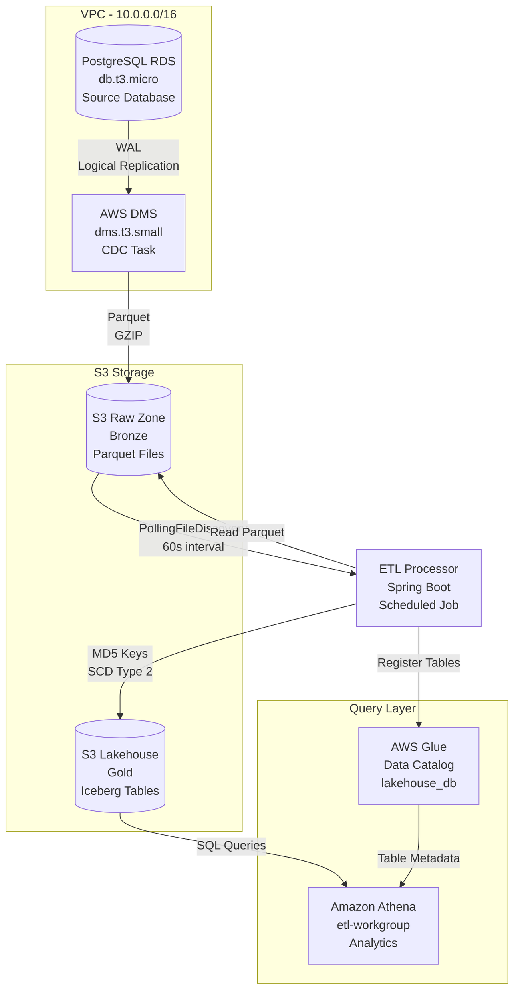
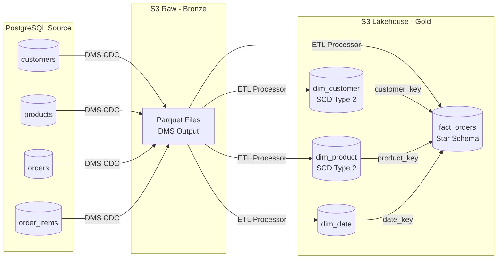

# CDC Data Lakehouse ETL

[](https://aws.amazon.com/cdk/)
[](https://www.java.com/)
[](https://spring.io/projects/spring-boot)
[](https://iceberg.apache.org/)

A CDC (Change Data Capture) ETL pipeline that replicates PostgreSQL data to an Apache Iceberg lakehouse on AWS using DMS, S3, and Glue.

## Architecture



### Data Flow



## Project Structure

```
cdc-data-lakehouse-etl/
├── cdk-infra/                  # AWS CDK infrastructure (Java)
│   └── src/main/java/com/cdc/infra/
│       ├── CdcInfraApp.java    # CDK app entry point
│       └── LakehouseStack.java # VPC, RDS, DMS, S3, Glue, Athena
├── etl-processor/              # Spring Boot ETL processor
│   └── src/main/java/com/cdc/etl/
│       ├── config/             # Spring configuration
│       ├── discovery/          # FileDiscovery strategy (polling/event-driven)
│       ├── reader/             # S3 Parquet reader
│       ├── transformer/        # Star Schema assembly, MD5 keys, SCD-2
│       ├── iceberg/            # Iceberg table writer
│       ├── glue/               # Glue Catalog sync
│       └── orchestrator/       # Scheduled ETL pipeline
├── scripts/                    # Utility scripts
│   ├── seed-data.sh            # Database seed script
│   ├── verification-queries.sql# Athena verification queries
│   └── smoke-test.sh           # End-to-end smoke test
├── docker-compose.yml          # Local development (PostgreSQL)
└── pom.xml                     # Parent POM (multi-module)
```

## Technology Stack

| Component | Technology | Version |
|-----------|------------|---------|
| Language | Java | 17 |
| Framework | Spring Boot | 3.2.5 |
| Infrastructure | AWS CDK (Java) | 2.138.0 |
| Database | PostgreSQL | 14 |
| CDC | AWS DMS | 3.5.4 |
| Storage | Amazon S3 | - |
| Table Format | Apache Iceberg | 1.5.2 |
| Catalog | AWS Glue | - |
| Analytics | Amazon Athena | - |
| Build | Maven | 3.9+ |
| Testing | JUnit 5, Testcontainers | 5.10, 1.19 |

## Key Design Decisions

- **FileDiscovery Strategy Pattern**: Polling now, event-driven (SQS) later with zero code changes
- **SCD Type 2**: Dimension history tracked with `is_current`, `effective_start_date`, `effective_end_date`
- **MD5 Surrogate Keys**: Python-compatible formula `int(md5_hex[:16], 16)` for cross-language consistency
- **Parquet Intermediate Format**: DMS writes Parquet natively, Iceberg reads it natively
- **Feature-Branch-Chain PRs**: PR1 (Foundation) → PR2 (ETL Core) → PR3 (Tests)

## Prerequisites

- Java 17+
- Maven 3.9+
- Node.js 18+ (for CDK CLI)
- AWS CLI configured
- Docker (for local development)

## Quick Start

### 1. Install dependencies

```bash
# Install CDK CLI
npm install -g aws-cdk

# Verify
cdk --version
```

### 2. Deploy infrastructure

```bash
cd cdk-infra
mvn compile
cdk bootstrap  # First time only
cdk deploy
```

### 3. Seed database

```bash
# Using Docker (requires running Docker daemon)
docker run --rm -e PGPASSWORD='<password>' postgres:14 \
  psql -h <rds-endpoint> -p 5432 -U etl_user -d ecommerce \
  -f scripts/seed-data.sh
```

### 4. Run ETL processor

```bash
cd etl-processor
mvn spring-boot:run
```

### 5. Query with Athena

```sql
-- Star schema join
SELECT c.name, p.category, SUM(f.quantity * f.unit_price) as total
FROM fact_orders f
JOIN dim_customer c ON f.customer_key = c.customer_key
JOIN dim_product p ON f.product_key = p.product_key
WHERE c.is_current = true AND p.is_current = true
GROUP BY c.name, p.category
ORDER BY total DESC;
```

## AWS Resources

| Resource | Type | Purpose |
|----------|------|---------|
| VPC | `AWS::EC2::VPC` | Network isolation |
| RDS PostgreSQL | `AWS::RDS::DBInstance` | Source database (db.t3.micro) |
| DMS Replication | `AWS::DMS::ReplicationInstance` | CDC capture (dms.t3.small) |
| S3 Raw Bucket | `AWS::S3::Bucket` | DMS Parquet output (Bronze) |
| S3 Lakehouse Bucket | `AWS::S3::Bucket` | Iceberg tables (Gold) |
| Glue Database | `AWS::Glue::Database` | Iceberg catalog |
| Athena Workgroup | `AWS::Athena::WorkGroup` | SQL analytics |

## Cost Estimate

| Resource | Monthly Cost |
|----------|-------------|
| RDS db.t3.micro | Free Tier (750h) |
| DMS dms.t3.small | ~$35 |
| S3 (5GB) | Free Tier |
| Glue/Athena | Pay-per-query |

> **Note**: DMS is the main cost driver. Stop the replication instance when not in use.

## Development

### Run tests

```bash
# Unit tests only
mvn test -Dgroups='!integration'

# All tests (requires Docker)
mvn test
```

### Local development

```bash
# Start local PostgreSQL
docker-compose up -d

# Run ETL processor locally
cd etl-processor
mvn spring-boot:run -Dspring.profiles.active=local
```

### Clean up

```bash
cdk destroy
```

## Migration Path

The `FileDiscovery` interface supports future migration from polling to event-driven:

1. Create `SqsFileDiscovery` implementation (~30 lines)
2. Add SQS + S3 notification to CDK (~20 lines)
3. Switch Spring `@Bean` (1 line change)
4. `cdk deploy` (~5 minutes)

**Total**: ~1 hour, zero changes to Transformer/IcebergWriter/GlueCatalogSync.
